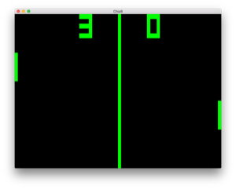
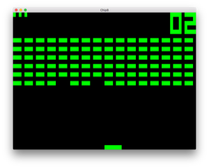
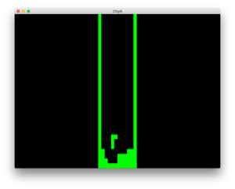

## Summary
This is a [CHIP-8](https://en.wikipedia.org/wiki/CHIP-8) emulator, written in Go.

## Screenshots






## Dependencies

[Go 1.9](https://golang.org/doc/go1.9) is required, so if you have an older
version, you will need to upgrade.  Additionally, the following libraries are
used:

	github.com/go-gl/gl/v2.1/gl
	github.com/go-gl/glfw/v3.2/glfw
	github.com/nsf/termbox-go

## Installation

The `go get` command will fetch the source and dependencies, compile the binary

```bash
> go get github.com/jtharris/chip8
```

## Usage

To run a game, specify the file as the first argument:

```bash
> chip8 games/BRIX
```

#### Render modes

The default behavior is to use OpenGL to render the display.  There is also
a terminal version available using the `-terminal` flag:

```bash
> chip8 -terminal games/PONG2
```

#### Printing opcodes

If you are curious about the opcodes for a particular game, you can print those
with the `-print` flag:

```bash
> chip8 -print games/VBRIX
```

## Controls

CHIP-8 input is based on a hex-keyboard, with the following layout.  This is mapped
to a QWERTY keyboard by using 4x4 block of keys from 1 in the upper left corner
to V in the lower right corner.

The first value is the hex value, and in parentheses is the QWERY key.  Games
that you will find on the internet typically don't have any sort of documentation,
so initially you will probably just have to bang around on these until you find
the buttons that work.

|       |       |       |       |
|-------|-------|-------|-------|
| 1 (1) | 2 (2) | 3 (3) | C (4) |
| 4 (Q) | 5 (W) | 6 (E) | D (R) |
| 7 (A) | 8 (S) | 9 (D) | E (F) |
| A (Z) | 0 (X) | B (C) | F (V) |

When running in terminal mode, the ESC key will quit.

## Known Issues

Opcodes were implemented as needed in order to get certain games to work.  There
are a few stragglers that weren't being used in the games I have been running.
